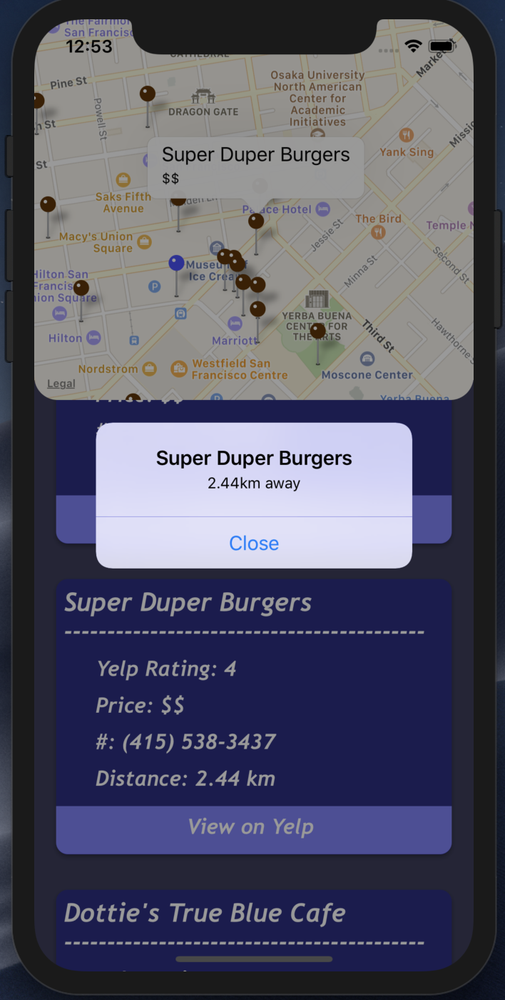
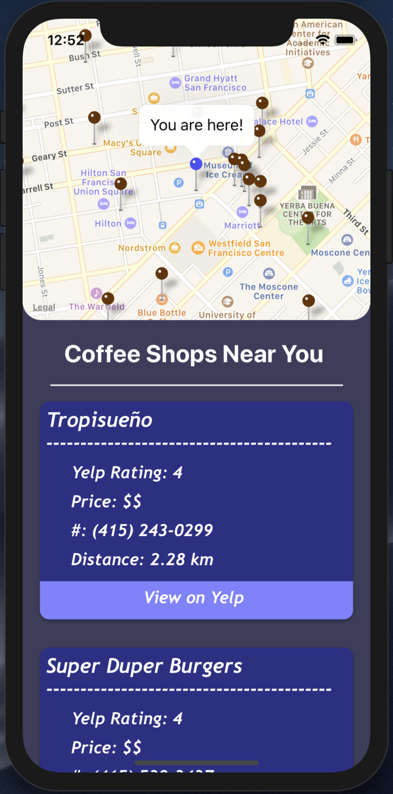
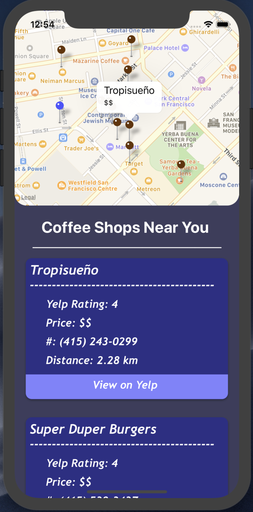

# Caffeine Finder

## Coffee shop finder mobile app built on React-Native

### Caffeine Finder is powered by React-Native/React-Native-Maps/Node.js/Express.js/Yelp Fusion API

    

### About
- **Caffeine Finder** is a cross platform mobile application allowing users to find cafés and coffee shops within a walkable distance around them. The app takes the users location and retrieves restaurants utlizing the Yelp Fusion API.

    
    
    

- I made this application to test out the current state of the react-native-maps expansion library made by the react-native community, my verdict is that it functions well albeit being slightly slow and laggy on the emulator. This application does not use the full potential of react-native-maps.

    

### Software
- **React-Native** on the front-end, supports both iOS and Android, tested on iOS
- **React-Native-Maps** used to provide OS native maps to the client and to provide geolocation,navigation, and position markers.
- **Node.js** and **Express.js** powered server on the back-end along with the **Yelp Fusion API** to retrieve POI information

### Author
- **Sasank Ganapathiraju**